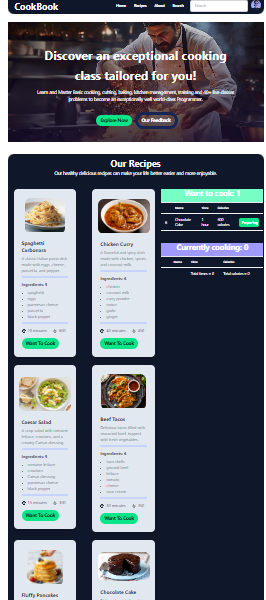

# CookBook
A website of having different food recipes.
-This is a basic react project using react hooks, tailwindcss, daisyui, react-hot-toast, react-icons.
-click functions can add, delete items.
-data stored in local storage.

Currently, two official plugins are available:

- [@vitejs/plugin-react](https://github.com/vitejs/vite-plugin-react/blob/main/packages/plugin-react/README.md) uses [Babel](https://babeljs.io/) for Fast Refresh
- [@vitejs/plugin-react-swc](https://github.com/vitejs/vite-plugin-react-swc) uses [SWC](https://swc.rs/) for Fast Refresh
